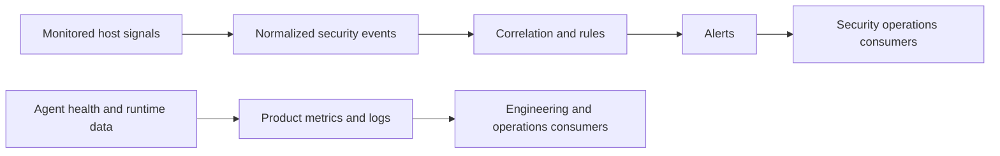
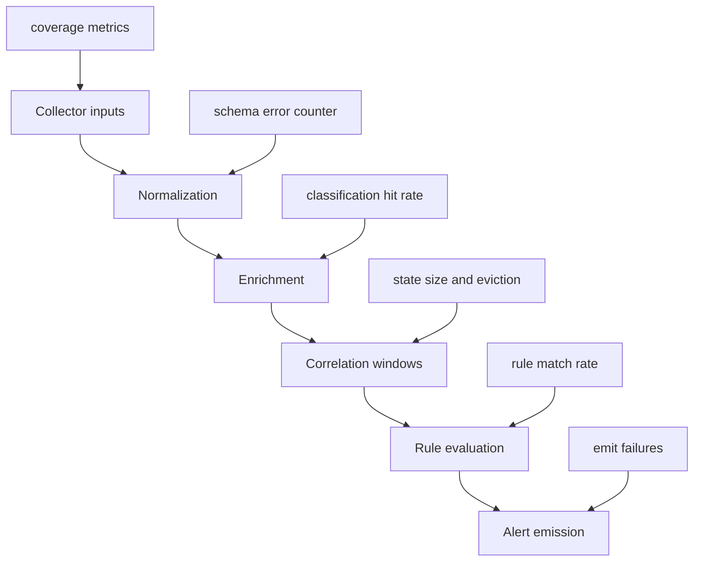

# ZeroTrace Observability and Monitoring Plan

## Purpose

ZeroTrace must be observable as both a product and a detection system. This means monitoring not only whether the software is alive, but also whether it is collecting enough telemetry and producing credible detection outcomes.

## Monitoring Boundaries

ZeroTrace has two different data planes that must remain conceptually separate:

1. product telemetry: metrics and logs about ZeroTrace itself
2. monitored-host telemetry: security events collected from monitored systems

They serve different purposes and must not be mixed casually.

## Logs

### Product Logs

Purpose: debug and operate the ZeroTrace agent or future backend.

Recommended fields:

1. timestamp
2. level
3. component
4. message
5. collector name
6. config version
7. rule bundle version
8. error detail

Examples:

1. collector startup success or failure
2. config reload result
3. alert emit failure
4. queue backlog or drop warning

### Monitored-Host Telemetry

Purpose: support security detection and investigation.

Recommended handling:

1. treat events and alerts as security data, not app logs
2. store alerts separately from product logs
3. avoid logging raw event payloads in operational logs

## Metrics

### Core Agent Metrics

| Metric | Meaning | Why It Matters |
| --- | --- | --- |
| `zt_agent_uptime_seconds` | Agent runtime duration | Detect crash loops |
| `zt_collector_health` | Per-collector health state | Coverage visibility |
| `zt_events_received_total` | Count of normalized events | Baseline activity and pipeline continuity |
| `zt_events_dropped_total` | Count of dropped events | Data loss signal |
| `zt_event_processing_latency_seconds` | Event pipeline latency | Detect slow correlation path |
| `zt_active_correlation_windows` | Number of in-flight windows | Detect state growth or stuck windows |
| `zt_rules_evaluated_total` | Rule evaluation count | Rule engine throughput |
| `zt_alerts_emitted_total` | Alert count by severity and rule | Detection volume and drift |
| `zt_alert_emit_failures_total` | Failed alert writes or sends | Reliability risk |
| `zt_config_reload_total` | Config reload attempts and outcomes | Operational safety |

### Collector Metrics

1. process event rate
2. file event rate
3. archive event rate
4. network event rate
5. collector-specific error counters
6. collector lag or queue depth where applicable

## Tracing

### MVP Position

The local-only agent does not need distributed tracing.

### Future Design

Distributed tracing becomes useful when ZeroTrace has an optional control plane with:

1. API gateway
2. config service
3. alert ingestion service
4. rule distribution service

If introduced, tracing must cover service-to-service product operations only. It must not include raw monitored-host telemetry payloads in spans.

## Health Signals

### Required Agent Health Signals

1. process collector health
2. file collector health
3. archive collector health
4. network collector health
5. config validity
6. last alert write success
7. event drop rate

### Degraded States That Must Be Visible

1. collector unavailable due to missing capability
2. event drops above threshold
3. alert file unwritable
4. rule bundle missing or invalid
5. clock skew or timestamp anomalies

## Telemetry Quality Monitoring

Telemetry quality is separate from raw software uptime. The agent can be alive and still blind.

### Quality Signals

1. sudden drop to zero in a collector that should be active
2. large mismatch between process activity and file or network activity
3. no sensitive path hits across a host class where some are expected
4. repeated path classification failures
5. excessive event drops during bursts

### Suggested Quality Checks

1. alert if `zt_events_received_total` is flat for a host that was recently active
2. alert if one collector is degraded for more than `15m`
3. flag hosts with zero alerts and zero sensitive hits for extended periods as potential blind spots

## Detection Pipeline Monitoring

### Pipeline Indicators

1. schema normalization failures
2. enrichment classification misses
3. correlation state growth beyond expected bounds
4. rule match rate changes after config or rule updates
5. alert emission failures or backlog growth

## Alerting Recommendations

### Product or Platform Alerts

1. agent down or restart loop
2. collector health failed
3. event drops exceed threshold
4. config reload failure
5. local alert store write failure
6. future control-plane ingestion backlog exceeds threshold

### Detection-Quality Alerts

1. sudden spike in alerts after a rule update
2. sudden collapse in alert volume across many hosts
3. hosts with persistent coverage gaps
4. sustained false-positive incident declared by detections team

## SLI and SLO Suggestions

### MVP Local Agent

| SLI | Target SLO |
| --- | --- |
| Agent runtime healthy | `99.5%` |
| At least one expected collector healthy on supported hosts | `>= 99%` |
| p95 alert generation latency after final triggering event | `< 5s` |
| Local alert write success | `>= 99.9%` |

### Future Control Plane

| SLI | Target SLO |
| --- | --- |
| Alert ingestion acceptance | `>= 99.9%` |
| Config retrieval success | `>= 99.5%` |
| Rule retrieval latency p95 | `< 2s` |

## Data Retention Guidance

1. product metrics retention should support trend analysis and release regression review
2. product logs should be retained long enough to troubleshoot recent incidents
3. monitored-host telemetry retention must be intentional and documented separately from product telemetry

## Operational Dashboards

Recommended dashboard sections:

1. agent health by collector
2. event and alert throughput
3. top rules by alert volume
4. event drop trends
5. config version distribution
6. rule bundle version distribution

## Review Cadence

1. review metrics and alert thresholds before each release
2. review false-positive and blind-spot indicators after each rule bundle change
3. review telemetry minimization boundaries whenever new fields are proposed
