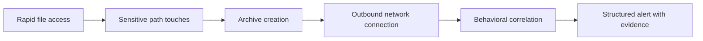

# ZeroTrace Product Requirements Document

## Product Summary

**Product:** ZeroTrace  
**Tagline:** Detecting data exfiltration even when attackers leave no trace.

ZeroTrace is a lightweight open-source endpoint detection agent focused on one problem: identifying suspicious behavioral sequences that commonly precede or complete data exfiltration from Linux systems. The MVP prioritizes high-signal local detection over broad platform coverage.

## Problem Statement

Attackers and malicious insiders rarely begin exfiltration with a single obvious network event. They often follow a sequence:

1. enumerate or rapidly collect files
2. access sensitive-looking paths
3. package data into an archive or compressed blob
4. initiate an outbound transfer to an external destination

Many teams can see fragments of this activity in isolated logs, but they lack host-local behavioral correlation with enough context to act quickly. Traditional DLP products often require content inspection, heavy deployment, or centralized infrastructure before they deliver value. ZeroTrace aims to detect suspicious exfiltration behaviors directly on the endpoint, with explainable alerts and a low operational footprint.

## Target Users and Personas

| Persona | Primary Need | Pain Today | ZeroTrace Value |
| --- | --- | --- | --- |
| Security engineer at a small or mid-sized SaaS company | Detect exfiltration from Linux servers without deploying a full EDR stack | Host telemetry is fragmented, noisy, or missing | Single binary, local correlation, JSON alerts, explainable evidence |
| Incident responder or SOC analyst | Triage suspicious host activity fast | Logs show only one step of the chain, requiring manual reconstruction | Alert includes sequence context: file activity, archive creation, outbound destination |
| Platform/SRE owner of production Linux hosts | Add targeted exfiltration detection with minimal overhead | Security agents are often too heavy or invasive | Linux-first, low-footprint, CLI-first, minimal data capture |
| Security consultant, lab operator, or contributor | Deploy or evaluate a focused detector quickly | Tooling setup time is high for short engagements and OSS projects need a fast path to local validation | Local-only mode works before any optional control plane exists |

## Primary Use Cases

1. Detect post-compromise smash-and-grab file collection on a production Linux server.
2. Detect suspicious access to secrets, SSH keys, `.env` files, database dumps, backups, and home-directory archives.
3. Detect archive creation followed by outbound network activity to an external IP, domain, or cloud storage endpoint.
4. Produce structured alerts that can be tailed locally, written to disk, or forwarded into an existing SOC pipeline.
5. Allow operators to validate configuration and test the detector locally without requiring a backend.

## Product Goals

1. Detect high-confidence exfiltration-related behavioral sequences on Linux hosts.
2. Keep the MVP deployable as a single local agent with no mandatory control plane.
3. Emit structured, machine-readable alerts with enough evidence for first-pass triage.
4. Maintain a small operational footprint suitable for always-on use on servers.
5. Make detection logic understandable and testable rather than opaque.

## Non-Goals

1. Full EDR coverage across all MITRE ATT&CK tactics.
2. Malware prevention, process blocking, or real-time response actions in the MVP.
3. Full content-inspecting DLP.
4. Windows or macOS support in the MVP.
5. Deep packet inspection or payload capture.
6. Large-scale hosted analytics, multitenancy, or mandatory central services in the MVP.

## MVP Scope

### In Scope

1. Linux-first local agent written in Go.
2. Telemetry collection for:
   - process execution
   - file access on configured sensitive paths
   - archive creation activity
   - outbound network connection attempts
3. In-memory correlation of related events over short time windows.
4. Rule-driven behavioral detection and local alert generation.
5. JSON and human-readable CLI output.
6. Config file validation and runtime health/status commands.
7. Local persistence for alerts and minimal operational logs.

### Out of Scope

1. Central alert storage as a requirement for detection.
2. Cross-host correlation.
3. User-behavior analytics or anomaly models requiring historical baselines.
4. Kernel malware/rootkit detection.
5. Automatic response actions such as process kill, firewall blocks, or file quarantine.

## Product Principles

1. Sequence beats signal: favor correlating a credible chain of weaker events over alerting on a single noisy event.
2. Explainability over black-box scoring: every alert must include concrete evidence and timestamps.
3. Minimal telemetry by default: collect metadata necessary for exfil detection, not file contents.
4. Local value first: a single host should benefit from ZeroTrace before any optional control plane exists.
5. Safe defaults: secure-by-default config, conservative data handling, and explicit opt-in for remote export.

## MVP Functional Requirements

1. The agent must observe process starts for suspicious tools and parent-child relationships.
2. The agent must identify access to configured sensitive paths and sensitive-looking filename patterns.
3. The agent must identify archive creation activity from common tools such as `tar`, `zip`, `7z`, `gzip`, and `xz`.
4. The agent must identify outbound network connections and classify internal vs external destinations.
5. The detection engine must correlate process, file, archive, and network events into alerts within a bounded lookback window.
6. Alerts must include severity, confidence, rule ID, title, summary, timestamps, process context, and event evidence.
7. The CLI must support `run`, `status`, `config validate`, `alerts tail`, `rules list`, and `self-test` style workflows.
8. The agent must continue operating in local-only mode if no control plane is configured.

## MVP Non-Functional Requirements

1. Average CPU overhead should remain below `2%` on a typical idle-to-moderate Linux server baseline.
2. Resident memory target should remain below `100 MB` under steady-state default workloads.
3. Alert generation latency should remain below `5 seconds` from the final triggering event for high-confidence rules.
4. The agent must degrade gracefully when a collector is unavailable, and clearly report degraded coverage.
5. Structured output must remain stable enough for downstream parsing.

## Example MVP Detections

1. A process reads many files under `/etc`, `/home/*/.ssh`, and `/srv/backups`, then invokes `tar`, then connects to an external IP.
2. A user shells into a host, accesses `.env`, backup, and key material, compresses them with `zip`, then uploads via `scp` or `curl`.
3. A process tree creates a temporary archive under `/tmp` and immediately initiates a TLS connection to an unapproved external destination.

## Future Roadmap

### Phase 1: Local MVP

1. Linux agent
2. Local rules and alerts
3. CLI-first operations
4. Basic self-test scenarios

### Phase 2: Optional Control Plane

1. Agent registration and config distribution
2. Remote alert ingestion
3. Central rule management
4. Multi-host health/status API

### Phase 3: Investigation and Tuning

1. Alert search and evidence drill-down
2. Rule exceptions and allowlists
3. Telemetry replay for rule QA
4. Detection performance dashboards

### Phase 4: Platform Expansion

1. Cross-host correlation
2. Additional Linux distributions and kernels
3. Future Design: Windows and macOS collectors
4. Future Design: limited automated response actions

## Success Metrics

| Area | Metric | MVP Target |
| --- | --- | --- |
| Detection quality | True positive rate on curated exfil simulation scenarios | `>= 90%` for supported scenarios |
| Detection quality | High-severity false positives on clean baseline hosts | `<= 0.5` per host per day |
| Performance | Average CPU overhead | `< 2%` |
| Performance | Resident memory | `< 100 MB` |
| UX | Time from install to validated first alert using self-test | `< 15 minutes` |
| Reliability | Alert schema completeness for required fields | `>= 95%` |
| Operations | Hosts with healthy collectors after install on supported baseline | `>= 95%` |

## Risks and Assumptions

- `Assumption:` The first supported environment is modern Linux servers with kernels commonly used in current LTS distributions.
- `Assumption:` ZeroTrace can rely on host-level privileges sufficient for file, process, and network metadata collection.
- `Assumption:` Users and self-hosting operators prefer metadata-only detection in the MVP over content-inspecting DLP.
- Risk: Linux telemetry collection differs across distributions and kernel versions, especially where eBPF, audit, or fanotify capabilities vary.
- Risk: Path-based sensitivity heuristics can generate noise if default patterns are too broad.
- Risk: Encrypted, chunked, or living-off-the-land exfiltration may avoid simple archive-based heuristics.
- Risk: Local-only mode limits multi-host trend analysis and coordinated response.
- `TBD:` Exact supported kernel, filesystem, and container runtime matrix for the first release.
- `TBD:` Initial default sensitive path patterns by distro and workload type.

## Release Criteria

1. Core collectors run successfully on each supported Linux test image.
2. Default rules detect the documented adversary simulation scenarios in the QA plan.
3. False-positive testing is completed on representative clean server workloads.
4. Alert output matches the documented schema and includes required evidence fields.
5. Configuration validation, degraded-health reporting, and self-test flows are implemented.
6. Packaging and upgrade instructions exist for local deployment.
7. Security review confirms least privilege posture, data minimization, and sane defaults.
8. Operational runbooks and monitoring guidance are published with the release.

## Open Questions

- `TBD:` Whether the first process and network collectors should default to eBPF, Linux audit, or a hybrid fallback model.
- `TBD:` Whether local durable event spooling is needed in the MVP, or if alert-only persistence is sufficient.
- `Future Design:` Optional control-plane enrollment, rule distribution, and API-driven alert ingestion are specified but not required for the first usable release.
