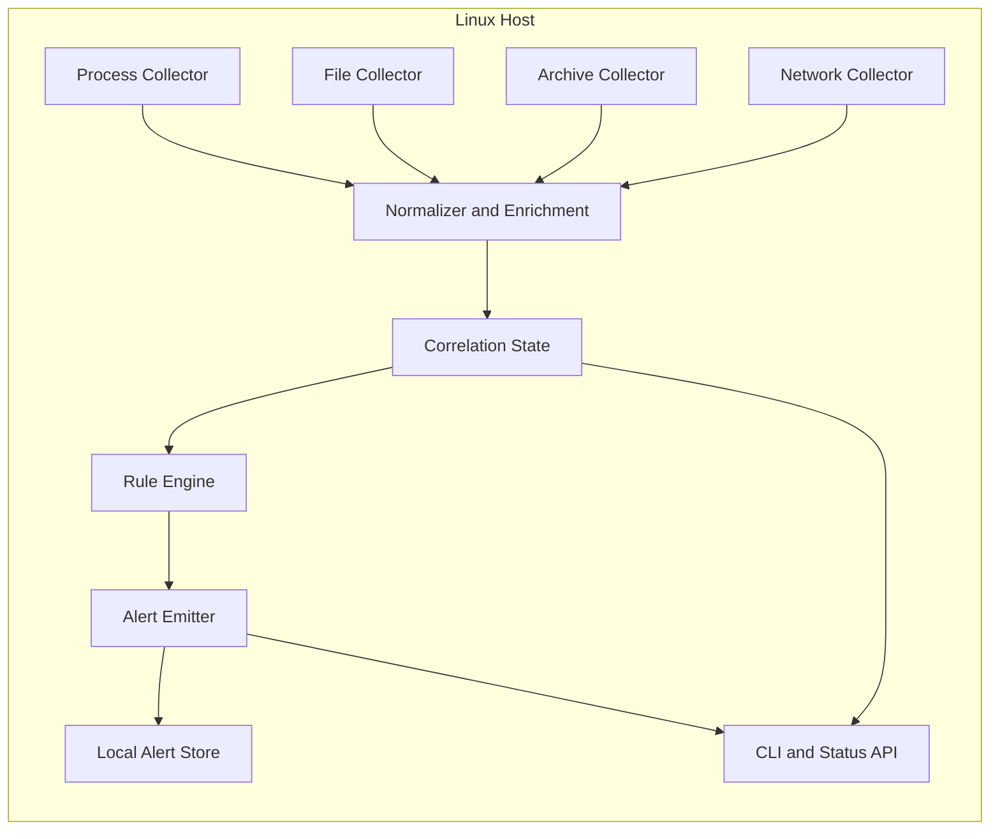
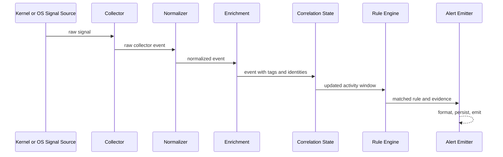
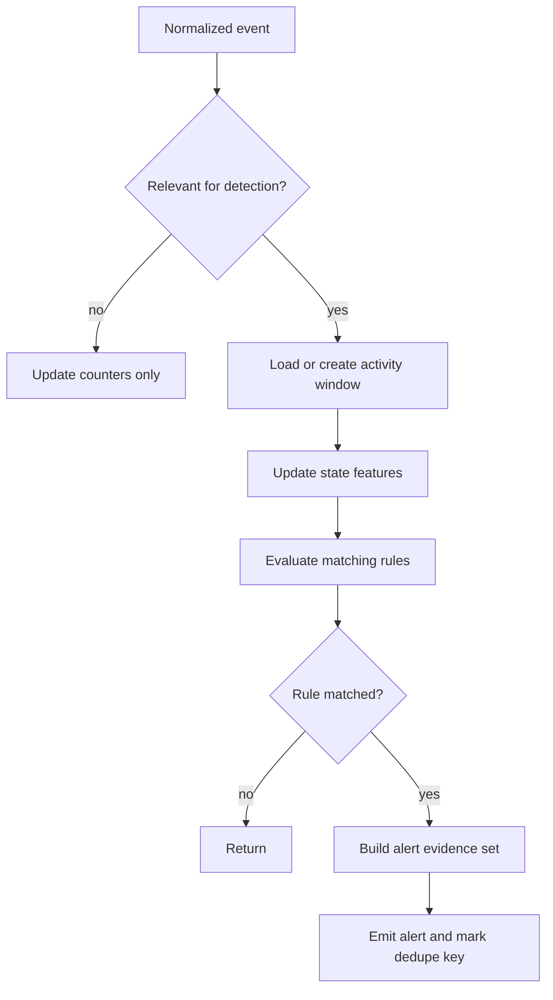

# ZeroTrace Technical Design Document

## Design Context

ZeroTrace currently has no implemented Go packages in the repository. This document defines the intended MVP architecture for an open-source, Linux-first behavioral detection agent that can operate locally without a control plane.

- `Assumption:` The agent will be implemented in Go `1.23+`.
- `Assumption:` The first supported execution model is a long-running system service managed by `systemd`.
- `TBD:` Final Linux signal sources will be selected after prototyping on target kernels and distros.

## Technical Objectives

1. Collect minimal host telemetry required to detect likely exfiltration behavior.
2. Normalize heterogeneous low-level signals into a stable internal event schema.
3. Correlate related events in memory with bounded resource usage.
4. Evaluate explicit, testable rules that produce explainable alerts.
5. Operate in local-only mode with optional future extension to a control plane.

## High-Level Architecture



## System Components

| Component | Responsibility | MVP Notes |
| --- | --- | --- |
| Collector manager | Starts, stops, and health-checks all collectors | Must surface partial collector failure clearly |
| Process collector | Captures process execution metadata and parent-child relations | Required for tool attribution and process tree correlation |
| File collector | Captures metadata for file open/read/enumeration on configured paths | Must avoid content capture |
| Archive collector | Detects creation of archive/compressed artifacts | Implemented through process and file event correlation |
| Network collector | Captures outbound connection attempts and destination metadata | No packet payload capture |
| Normalizer | Converts raw collector signals into a versioned internal event schema | Central compatibility boundary |
| Enrichment | Adds tags such as sensitivity label, external destination, archive tool family | Keeps rules simpler |
| Correlation store | Maintains short-lived behavioral state windows in memory | No database required for MVP |
| Rule engine | Evaluates sequence and threshold rules against state changes | Deterministic and testable |
| Alert emitter | Produces JSON alerts and human-readable summaries | Can write to stdout and local file |
| Config loader | Reads, validates, and reloads config | Must reject unsafe or inconsistent config |
| CLI | Operates the agent and exposes local status | Core operator UX for MVP |

## Event Pipeline



### Pipeline Stages

1. Raw signal capture from Linux-specific mechanisms.
2. Normalization into a stable `Event` structure.
3. Enrichment with sensitivity, destination classification, and process lineage.
4. Correlation state update keyed by process tree and time window.
5. Rule evaluation triggered by relevant state changes.
6. Alert creation, output formatting, and optional local persistence.

## Collectors

### Process Collector

Purpose: observe process starts, executable paths, parent-child relationships, effective user, and command context needed for attribution.

- `Assumption:` Preferred sources are Linux audit or eBPF tracepoints, with fallback based on host capability.
- Required fields:
  - `pid`, `ppid`, `uid`, `gid`
  - executable path
  - command line or redacted argument summary
  - working directory if safely available
  - container or cgroup context if present
- Detection relevance:
  - identifies archive and transfer tools
  - anchors activity windows to a subject process tree
  - distinguishes user-initiated activity from system daemons

### File Collector

Purpose: observe file access on configured sensitive roots and sensitive-looking filename patterns.

- `Assumption:` MVP uses path-scoped monitoring to control noise and overhead.
- Required behaviors:
  - detect open/read or enumeration-like access events
  - tag paths against sensitivity policies
  - capture metadata only: path, inode if available, uid, pid, operation, timestamps
- Explicitly excluded:
  - file content capture
  - full filesystem crawling by default
- Risk:
  - some collection mechanisms expose open events more reliably than reads; rule tuning must account for backend limitations

### Network Collector

Purpose: observe outbound connection attempts and classify internal vs external destinations.

- Required fields:
  - source process identity
  - destination IP, port, and resolved hostname if available
  - protocol
  - connection direction
  - bytes sent if cheaply observable, otherwise `TBD`
- MVP interpretation:
  - a connection is suspicious when it follows sensitive file access or archive creation within the correlation window
- Excluded:
  - packet payload capture
  - TLS interception

### Archive Collector

Purpose: detect data staging or packaging steps before transfer.

- `Assumption:` MVP archive detection will combine process execution and file creation evidence instead of parsing archive contents.
- Sources:
  - process executions of common tools: `tar`, `zip`, `7z`, `gzip`, `xz`, `bzip2`
  - output file creations matching archive extensions or temp staging patterns
- Key outputs:
  - tool family
  - target archive path
  - size metadata if available
  - linked upstream sensitive file activity

## Event Schema

The normalized event is the compatibility boundary between collectors and the detection engine.

### Event Structure

| Field | Type | Required | Description |
| --- | --- | --- | --- |
| `event_id` | string | yes | Stable unique ID for the event |
| `schema_version` | string | yes | Event schema version, starting at `v1` |
| `event_type` | string | yes | One of `process.exec`, `file.open`, `file.read`, `file.enumerate`, `archive.create`, `network.connect` |
| `occurred_at` | RFC3339 timestamp | yes | Original event time on host |
| `host` | object | yes | Host identity and OS metadata |
| `actor` | object | yes | Process/user responsible for the action |
| `file` | object | conditional | File context for file or archive-related events |
| `network` | object | conditional | Network context for outbound connection events |
| `archive` | object | conditional | Archive metadata for archive events |
| `labels` | map[string]string | no | Enrichment labels such as `sensitivity=secret` |
| `collector` | object | yes | Collector name and backend type |

### Host Object

| Field | Description |
| --- | --- |
| `host_id` | Agent-local or managed identity |
| `hostname` | Current hostname |
| `os` | Example: `linux` |
| `kernel_version` | Host kernel version |
| `container_context` | Optional cgroup or container metadata |

### Actor Object

| Field | Description |
| --- | --- |
| `pid` | Process ID |
| `ppid` | Parent process ID |
| `process_name` | Short process name |
| `executable_path` | Full executable path if available |
| `command_line` | Redacted or truncated command line |
| `uid` | User ID |
| `username` | Username if resolvable |
| `session_id` | Optional login/session reference |
| `process_tree_id` | Stable correlation key for the process tree |

### Example Event

```json
{
  "event_id": "evt_01JZT5G1TX7A3XKED2CN6F8M4R",
  "schema_version": "v1",
  "event_type": "archive.create",
  "occurred_at": "2026-03-09T13:31:19Z",
  "host": {
    "host_id": "host_web_01",
    "hostname": "web-01",
    "os": "linux",
    "kernel_version": "6.6.12"
  },
  "actor": {
    "pid": 4182,
    "ppid": 4044,
    "process_name": "tar",
    "executable_path": "/usr/bin/tar",
    "command_line": "tar -czf /tmp/stage.tgz [REDACTED]",
    "uid": 1001,
    "username": "deploy",
    "process_tree_id": "ptree_5a2fca7c"
  },
  "archive": {
    "path": "/tmp/stage.tgz",
    "format": "tar.gz",
    "tool": "tar"
  },
  "labels": {
    "sequence_stage": "archive",
    "sensitivity_context": "contains_sensitive_inputs"
  },
  "collector": {
    "name": "archive",
    "backend": "process-plus-file"
  }
}
```

## Alert Schema

Alerts must be explainable and stable enough for downstream ingestion.

| Field | Type | Required | Description |
| --- | --- | --- | --- |
| `alert_id` | string | yes | Unique alert ID |
| `schema_version` | string | yes | Alert schema version |
| `rule_id` | string | yes | Triggering rule |
| `severity` | string | yes | `low`, `medium`, `high`, `critical` |
| `confidence` | string | yes | `low`, `medium`, `high` |
| `title` | string | yes | Short alert title |
| `summary` | string | yes | One-paragraph explanation |
| `first_seen_at` | timestamp | yes | Earliest related event |
| `last_seen_at` | timestamp | yes | Latest related event |
| `host` | object | yes | Host context |
| `primary_actor` | object | yes | Main process/user context |
| `evidence` | array | yes | Ordered event excerpts supporting the alert |
| `recommended_actions` | array | no | Triage suggestions |
| `mitre_attack` | array | no | Techniques such as `T1005`, `T1560`, `T1041` |
| `status` | string | yes | `open` initially |

### Example Alert

```json
{
  "alert_id": "alt_01JZT5N2Y3QSM8B3W3R3NQ4KJJ",
  "schema_version": "v1",
  "rule_id": "linux.exfil.sequence.archive_then_egress",
  "severity": "high",
  "confidence": "high",
  "title": "Sensitive file collection followed by archive and outbound connection",
  "summary": "Process tree led by /usr/bin/bash accessed 37 sensitive files, created /tmp/stage.tgz, and initiated an outbound connection to 203.0.113.24:443 within 6 minutes.",
  "first_seen_at": "2026-03-09T13:25:02Z",
  "last_seen_at": "2026-03-09T13:31:20Z",
  "host": {
    "host_id": "host_web_01",
    "hostname": "web-01"
  },
  "primary_actor": {
    "pid": 4044,
    "process_name": "bash",
    "uid": 1001,
    "username": "deploy"
  },
  "evidence": [
    {
      "event_type": "file.read",
      "occurred_at": "2026-03-09T13:25:02Z",
      "detail": "Read /home/deploy/.ssh/id_rsa"
    },
    {
      "event_type": "archive.create",
      "occurred_at": "2026-03-09T13:31:19Z",
      "detail": "Created /tmp/stage.tgz using tar"
    },
    {
      "event_type": "network.connect",
      "occurred_at": "2026-03-09T13:31:20Z",
      "detail": "Connected to 203.0.113.24:443"
    }
  ],
  "recommended_actions": [
    "Isolate host from network if activity is unauthorized",
    "Inspect the parent shell history and credential use"
  ],
  "mitre_attack": [
    "T1005",
    "T1560",
    "T1041"
  ],
  "status": "open"
}
```

## Collector Interfaces

The MVP should keep collector contracts simple and internal to the agent.

```go
type Collector interface {
    Name() string
    Start(ctx context.Context, out chan<- RawSignal) error
    Stop(ctx context.Context) error
    Health() ComponentHealth
}

type Normalizer interface {
    Normalize(signal RawSignal) (Event, error)
}

type Rule interface {
    ID() string
    Evaluate(window ActivityWindow, event Event) (*Alert, bool)
}
```

### Interface Design Notes

1. Collectors emit `RawSignal` rather than direct alerts.
2. The normalizer is the only layer allowed to construct first-class `Event` objects.
3. Rules evaluate the current activity window plus the triggering event, keeping rule logic deterministic.
4. Health must be queryable per collector for CLI status and monitoring.

## Detection Engine Design

The detection engine is sequence-oriented rather than anomaly-driven. The initial rule set should focus on explicit heuristics with strong operator explainability.

### Rule Evaluation Flow



### Rule Model

Each rule should define:

1. Event types of interest.
2. Lookback window.
3. Thresholds or sequence ordering constraints.
4. Filters such as sensitivity label, external destination, or archive tool family.
5. Deduplication key and suppression period.
6. Severity and confidence mapping.

### Example MVP Rules

1. `linux.exfil.sequence.archive_then_egress`
   - sensitive file reads above threshold
   - archive created within `10m`
   - external network connection within `2m` of archive
2. `linux.exfil.sequence.bulk_collect_then_cloud_upload`
   - rapid access to many sensitive files
   - execution of `rclone`, `aws`, `curl`, or `scp`
   - outbound destination not in allowlist
3. `linux.exfil.sequence_key_material_access`
   - access to SSH keys, kubeconfig, or `.env`
   - archive or transfer tool execution within lookback

## State and Correlation Model

The MVP uses in-memory state to keep the implementation small and local-first.

### Correlation Key

Primary key:

`host_id + process_tree_id + uid`

Optional secondary dimensions:

- destination identity
- container context
- archive output path

### Activity Window

Each window tracks:

1. first and last event time
2. counts of file reads and distinct sensitive paths
3. archive creation events
4. outbound destinations contacted
5. tool families executed
6. event excerpts required to construct evidence

### Retention Strategy

- Default active window duration: `15 minutes`
- Default expired window grace period for dedupe: `30 minutes`
- Evidence excerpt cap per window: `100` items
- Oldest evidence is evicted first once caps are reached

### Why In-Memory for MVP

1. Fast correlation path with no local database dependency.
2. Lower operational complexity for single-host deployment.
3. Aligns with short-lived exfiltration sequences, which are usually bounded in time.

### Known Limitations

1. State is lost on process restart.
2. Very long, low-and-slow exfiltration campaigns are harder to detect.
3. Cross-host sequences are impossible without a backend.

## Config Model

ZeroTrace should use a single explicit config file, defaulting to `/etc/zerotrace/config.yaml`.

### Config Example

```yaml
agent:
  mode: local
  log_level: info
  log_format: json
  state_dir: /var/lib/zerotrace

collectors:
  process:
    enabled: true
    backend: auto
  file:
    enabled: true
    sensitive_paths:
      - /etc
      - /home
      - /srv/backups
    exclude_paths:
      - /home/*/.cache
  network:
    enabled: true
    classify_private_as_internal: true
  archive:
    enabled: true
    tools:
      - tar
      - zip
      - 7z

detection:
  correlation_window: 15m
  dedupe_window: 30m
  default_sensitive_patterns:
    - "*.pem"
    - "*.key"
    - "*.env"
    - "*.sql"
    - "*.bak"
  allowlisted_destinations:
    - repo.internal.example

output:
  alert_stdout: true
  alert_file: /var/log/zerotrace/alerts.jsonl

privacy:
  capture_command_line: redacted
  remote_export_enabled: false
  path_redaction_mode: none

server:
  enabled: false
```

### Config Requirements

1. Validation must fail on unknown collector backends or invalid duration values.
2. Sensitive path configuration must support allow and exclude lists.
3. Remote export must be disabled unless explicitly configured.
4. Rule bundle version and config version should be visible in status output.

## Storage and Logging Approach

### Local State

- In-memory correlation windows for active detection.
- Local alert file in JSON Lines format for auditability and downstream tailing.
- Minimal agent metadata under `/var/lib/zerotrace` for runtime status and optional future durable queue.

### Logging

- Product logs are operational logs about the agent itself.
- Host telemetry is security event data and must never be mixed into product logs by default.
- Default operational log fields:
  - timestamp
  - level
  - component
  - message
  - collector name
  - config version
  - error cause

### Durable Queue

- `TBD:` Whether optional control-plane mode requires a disk-backed outbound queue for alerts and config acknowledgements.
- `Future Design:` A bounded on-disk queue should be added before control-plane-dependent alert delivery is considered production-ready.

## Extensibility Considerations

1. Keep `Event` and `Alert` schemas versioned from the start.
2. Keep collectors behind interfaces so alternative Linux backends can coexist.
3. Add new rule packs without changing collector contracts.
4. Avoid dynamic plugin loading in the MVP; prefer statically linked modules and versioned rule bundles.
5. Reserve optional server connectivity in config and API contracts without making it mandatory.

## Tradeoffs and Technical Risks

| Decision | Benefit | Cost or Risk |
| --- | --- | --- |
| Local-only MVP | Fast path to usable OSS project, low infrastructure burden | No multi-host management or cross-host analytics |
| In-memory correlation | Simple, fast, no local DB | State loss on restart |
| Metadata-only telemetry | Better privacy and smaller footprint | Lower fidelity than content-aware DLP |
| Path-scoped file monitoring | Reduced noise and overhead | Misses sensitive files outside configured scope |
| Explicit heuristic rules | Explainable and testable | Requires ongoing tuning and coverage expansion |

## Outstanding Technical TBDs

1. `TBD:` Exact collector backend matrix by distro and kernel.
2. `TBD:` Whether container context is a first-class field in the MVP or Phase 2.
3. `TBD:` Whether local alert persistence is file-based only or needs a lightweight embedded queue.
4. `Future Design:` Remote rule distribution and optional control-plane acknowledgement flow.
