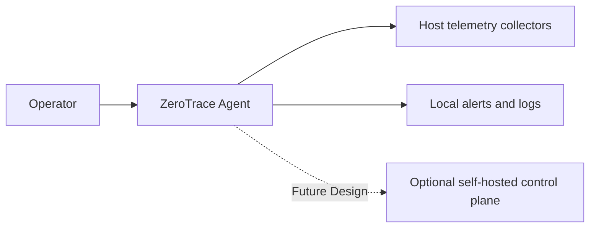

# ZeroTrace Threat Model

## Purpose

This threat model captures the main security assumptions, attacker goals, trust boundaries, and mitigation priorities for ZeroTrace as an open-source Linux security agent.

- `Assumption:` The first release is a local-only agent.
- `Future Design:` An optional self-hosted control plane may be added later.

## System Overview

ZeroTrace runs on a Linux host, collects minimal metadata from process, file, archive, and network activity, correlates suspicious sequences, and emits local alerts. Future designs may allow operators to self-host a control plane for config distribution and alert ingestion.

## Security Objectives

1. preserve agent integrity
2. avoid collecting data outside documented boundaries
3. prevent privilege misuse beyond what collectors require
4. make alert output trustworthy and explainable
5. keep local detection functional even if optional remote components fail

## Protected Assets

1. agent binary and release artifacts
2. config file and rule bundle
3. local alert store
4. host telemetry metadata
5. future enrollment tokens or API credentials
6. project reputation and trust in releases

## In-Scope Attackers

1. external attacker who gains command execution on a monitored host
2. malicious insider misusing legitimate host access
3. local unprivileged user attempting to tamper with ZeroTrace
4. network attacker targeting a future self-hosted control plane
5. attacker attempting supply-chain compromise through build or release paths

## Out of Scope

1. preventing all host compromise
2. defeating a fully privileged kernel-level adversary in the MVP
3. acting as a complete DLP or full EDR platform
4. guaranteeing protection for unsupported platforms

## Trust Boundaries

1. between the monitored host and the ZeroTrace agent
2. between the agent and local writable state
3. between maintainers and released artifacts
4. `Future Design:` between agents and an optional self-hosted control plane

## Main Attack Surfaces

1. privileged collectors
2. config loading and parsing
3. rule bundle parsing and evaluation
4. local alert and state file permissions
5. CLI and logging output
6. build, packaging, signing, and release distribution
7. `Future Design:` remote transport and control-plane auth

## Threats and Mitigations

| Threat | Impact | Initial Mitigation Direction |
| --- | --- | --- |
| Malicious config or path expansion | loss of coverage or unsafe writes | strict validation, explicit paths, reject unsafe destinations |
| Over-collection of sensitive data | privacy violation | metadata-only defaults, redaction modes, documented boundaries |
| Collector privilege misuse | host risk increase | least privilege, narrow capabilities, code review on collector changes |
| Tampered release artifact | compromised hosts | signed releases, checksums, provenance, reproducible build goals |
| Alert or log injection via crafted filenames or args | misleading operator output | escaping, truncation, structured output, redaction |
| Rule change causing false-positive storm | operator fatigue and distrust | rule tests, staged rollout, rollback guidance |
| Silent collector failure | blind detection gaps | explicit health signals, status output, degraded-state alerts |
| Future token leakage | unauthorized control-plane access | restrictive storage, rotation, no logging of secrets |

## Residual Risks

1. local-only mode cannot detect cross-host sequences
2. metadata-only telemetry can miss content-driven exfiltration
3. unsupported kernels may force weaker collection backends or no coverage
4. a fully privileged attacker may disable or tamper with the agent

## Security Review Triggers

The threat model should be revisited when:

1. a new collector backend is added
2. telemetry scope expands
3. optional control-plane features are implemented
4. new secrets or credentials are introduced
5. build or release tooling changes materially
