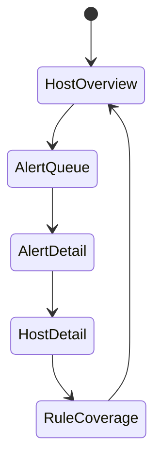

# ZeroTrace UI and UX Specification

## UX Scope

The ZeroTrace MVP is CLI-first. The UI must help operators install, validate, run, inspect, and troubleshoot a host-local detection agent without requiring a backend.

- `Assumption:` The primary operator uses a shell on a Linux server or through SSH.
- `Assumption:` Machine-readable output matters as much as human-readable output.
- `Future Design:` An optional self-hosted web console may exist later, but it must not define or block the local UX.

## UX Principles

1. Prefer short, high-signal terminal output over chatty logs.
2. Separate operational messages from security alerts.
3. Make degraded coverage explicit.
4. Keep output script-friendly and stable.
5. Make local troubleshooting possible without reading source code.

## CLI Command Structure

### Top-Level Commands

```text
zerotrace run
zerotrace status
zerotrace config validate
zerotrace config print
zerotrace rules list
zerotrace alerts tail
zerotrace events stream
zerotrace self-test exfil
zerotrace version
```

### Command Semantics

| Command | Purpose | Default Output |
| --- | --- | --- |
| `zerotrace run` | Start the agent in foreground mode | Alerts to `stdout`, operational logs to `stderr` |
| `zerotrace status` | Show collector health, rule count, config version, recent throughput | Human summary |
| `zerotrace config validate` | Validate syntax and semantic config correctness | Human summary with non-zero exit on error |
| `zerotrace config print` | Print effective config after defaults are applied | YAML or JSON |
| `zerotrace rules list` | Show loaded rules and metadata | Table or JSON |
| `zerotrace alerts tail` | Follow recent alerts from local store | Human or JSON Lines |
| `zerotrace events stream` | Stream normalized events for debugging | JSON Lines |
| `zerotrace self-test exfil` | Run a safe simulation scenario against the current detector | Human summary and generated alert IDs |
| `zerotrace version` | Show build metadata | Single line |

### Common Flags

```text
--config /etc/zerotrace/config.yaml
--output human|json|jsonl|yaml
--log-format text|json
--log-level debug|info|warn|error
--no-color
```

## Terminal Output Behavior

### Output Rules

1. Commands intended for human inspection default to human-readable output when connected to a TTY.
2. `run` and `events stream` must support newline-delimited JSON for piping.
3. Security alerts and operational logs must use separate streams in foreground mode:
   - alerts: `stdout`
   - product logs: `stderr`
4. Color is allowed only for TTY output and must be disabled automatically for non-TTY output.
5. Timestamps should default to ISO 8601 UTC.

### Human Output Example: Status

```text
$ zerotrace status

ZeroTrace Agent Status
----------------------
Host:              web-01
Mode:              local
Version:           0.1.0-dev
Config:            /etc/zerotrace/config.yaml
Config Version:    cfg_2026_03_09_01

Collectors
  process          healthy
  file             healthy
  archive          healthy
  network          degraded   destination bytes unavailable

Rules Loaded:      8 enabled / 0 disabled
Event Rate (1m):   142 events/min
Alerts (24h):      2 high, 3 medium, 0 critical
State Windows:     11 active
```

### Human Output Example: Rules List

```text
$ zerotrace rules list

RULE ID                                        SEVERITY  STATUS   LOOKBACK
linux.exfil.sequence.archive_then_egress       high      enabled  10m
linux.exfil.sequence.bulk_collect_then_upload  high      enabled  15m
linux.exfil.sequence_key_material_access       medium    enabled  10m
```

## Alert Formatting

### Human-Readable Alert

```text
[HIGH] Sensitive file collection followed by archive and outbound connection
Alert ID:       alt_01JZT5N2Y3QSM8B3W3R3NQ4KJJ
Rule ID:        linux.exfil.sequence.archive_then_egress
Host:           web-01
Process Tree:   bash(4044) -> tar(4182)
User:           deploy (uid=1001)
Window:         2026-03-09T13:25:02Z to 2026-03-09T13:31:20Z

Evidence
  13:25:02Z  file.read        /home/deploy/.ssh/id_rsa
  13:25:19Z  file.read        /srv/backups/prod.sql.gz
  13:31:19Z  archive.create   /tmp/stage.tgz via tar
  13:31:20Z  network.connect  203.0.113.24:443 external=true

Summary
  Process tree led by bash accessed 37 sensitive files, created an archive,
  and connected to an external destination within 6 minutes.
```

### JSON Alert Expectations

1. One alert per line in `jsonl` mode.
2. Field names must match the documented alert schema.
3. Stable top-level keys are required for downstream parsing.
4. Redacted fields must remain syntactically present rather than being silently omitted.

## Config UX

### Goals

1. Make it obvious which config file is active.
2. Catch invalid paths, durations, and mutually incompatible settings before runtime.
3. Surface warnings for weak but technically valid settings.

### Config Validation UX

```text
$ zerotrace config validate --config /etc/zerotrace/config.yaml

OK  config parsed
OK  collectors.process.enabled = true
OK  collectors.file.sensitive_paths = 3 paths
WARN output.alert_file does not exist yet; will be created at runtime
WARN privacy.capture_command_line = full increases secret exposure risk
```

### Validation Failure UX

```text
$ zerotrace config validate

ERROR invalid configuration
  field: collectors.network.backend
  value: rawsocket
  reason: supported values are auto, ebpf, audit

Hint: run `zerotrace config print --output yaml` to inspect effective defaults.
```

### Effective Config UX

Operators should be able to see which defaults were applied, especially for:

1. correlation windows
2. enabled collectors
3. sensitive path patterns
4. allowlisted destinations
5. privacy and redaction settings

## Error Handling UX

### UX Requirements

1. Errors must identify the failing subsystem.
2. Errors must explain the operational impact.
3. Recoverable errors should suggest the next command to run.
4. Fatal startup errors should exit non-zero with a single clear reason.

### Exit Code Proposal

| Exit Code | Meaning |
| --- | --- |
| `0` | Success |
| `2` | Invalid config |
| `3` | Missing privileges or unsupported kernel capability |
| `4` | Collector startup failure |
| `5` | Runtime degraded state escalated to fatal |
| `10` | Self-test failed to produce expected alert |

### Example Startup Failure

```text
ERROR failed to start file collector
component=file
reason=fanotify permission denied
impact=sensitive file access detection is unavailable
next_step=run `zerotrace status --output json` after correcting privileges
```

## ASCII Wireframes

### `zerotrace alerts tail --follow`

```text
+--------------------------------------------------------------------------------+
| ZeroTrace Alerts Tail                                                          |
+--------------------------------------------------------------------------------+
| Time (UTC)            Sev    Host     Rule                                User  |
| 2026-03-09T13:31:20Z  HIGH   web-01   archive_then_egress                 deploy|
| 2026-03-09T12:07:44Z  MED    db-02    key_material_access                 root  |
+--------------------------------------------------------------------------------+
| Selected Alert                                                                 |
| Title: Sensitive file collection followed by archive and outbound connection   |
| Process Tree: bash(4044) -> tar(4182)                                          |
| Destinations: 203.0.113.24:443                                                 |
| Sensitive Hits: /home/deploy/.ssh/id_rsa, /srv/backups/prod.sql.gz             |
| Recommendation: isolate host, inspect shell history, rotate exposed secrets    |
+--------------------------------------------------------------------------------+
```

### `zerotrace status --output human`

```text
+-------------------------------------------------------------------+
| ZeroTrace Agent Status                                            |
+-------------------------------------------------------------------+
| Host        web-01             Mode            local               |
| Version     0.1.0-dev          Config Version  cfg_2026_03_09_01  |
| Rules       8 enabled          Active Windows  11                  |
+-------------------------------------------------------------------+
| Collector   Health    Notes                                        |
| process     healthy   audit backend                                |
| file        healthy   3 sensitive roots watched                    |
| archive     healthy   process-plus-file correlation                |
| network     degraded  bytes_sent unavailable on this kernel        |
+-------------------------------------------------------------------+
| Last Alert   2026-03-09T13:31:20Z  high  archive_then_egress       |
+-------------------------------------------------------------------+
```

## Future Web Console Concepts

`Future Design:` An optional self-hosted web console should not attempt to reproduce a generic SIEM. It should stay focused on exfiltration sequences, host health, and detection tuning.

### Dashboard Objects

1. Multi-host health summary
2. Alert queue with evidence-first triage
3. Rule coverage and suppression tuning
4. Host detail page with collector health and recent sequence timeline

### ASCII Mockup: Self-Hosted Web Console

```text
+------------------------------------------------------------------------------------------------+
| ZeroTrace Hosts                                                                                |
+------------------------------------------------------------------------------------------------+
| Agents Healthy  184/191      Alerts Today  23       High Severity  4       Config Drift  3    |
+------------------------------------------------------------------------------------------------+
| Hosts With Issues                                                                              |
| web-01   high alert open       file access -> tar -> external TLS                              |
| db-02    collector degraded    network bytes unavailable                                       |
| ci-07    config drift          old rule bundle                                                 |
+------------------------------------------------------------------------------------------------+
| Recent High Alerts                                                                             |
| web-01   archive_then_egress    deploy   203.0.113.24:443   6m sequence                        |
| build-03 bulk_collect_upload   runner   s3.us-east-1.amazonaws.com                              |
+------------------------------------------------------------------------------------------------+
```

### Future Web Console States



## Accessibility and Usability Notes

1. Human output must remain readable over SSH and on narrow terminal widths.
2. Do not rely on color alone to convey severity or health.
3. JSON modes must not depend on ANSI formatting or column alignment.
4. Alert summaries should fit within a terminal log stream without wrapping into unreadable blocks.
